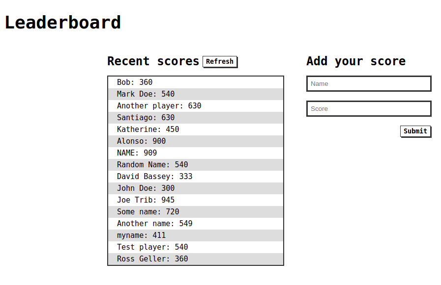

# Leaderboard List

Website that allows users to add scores to a list.

## Table of contents

- [Overview](#overview)
  - [Screenshot](#screenshot)
  - [Installation](#installation)
- [My process](#my-process)
  - [Built with](#built-with)
  - [Useful resources](#useful-resources)
- [Author](#author)

## Overview

### Screenshot



### Installation

- Clone this repository
```bash
$ git clone git@github.com:alonsofl/leaderboard.git
$ cd leaderboard/
```

- Run project
```bash
$ npm install
$ npm start # This will run webpack dev server
```

- Or build
```bash
$ npm run build # And open dist/index.html
```

## My process

### Built with

- HTML5
- CSS
- Javascript (ES6)
- Webpack

### Useful resources

- [Webpack - Getting Started](https://webpack.js.org/guides/getting-started/)

## Author

- Twitter - [@alonsofalconi](https://www.twitter.com/alonsofalconi)

Give a ⭐️ if you like this project!